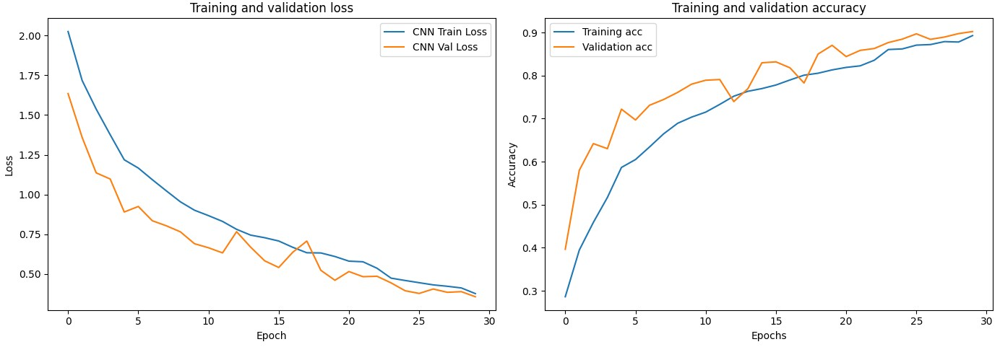
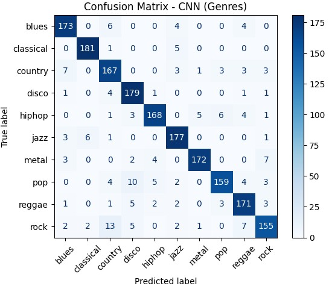
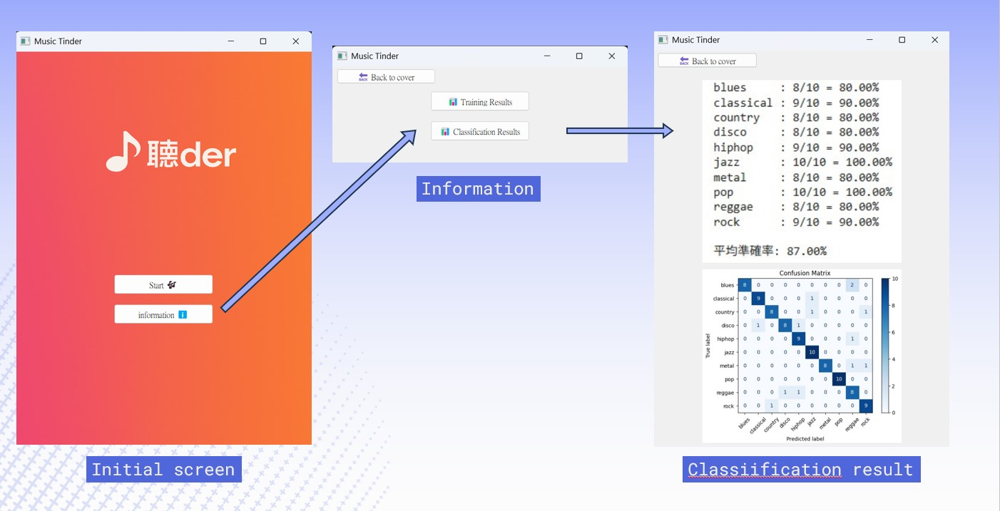
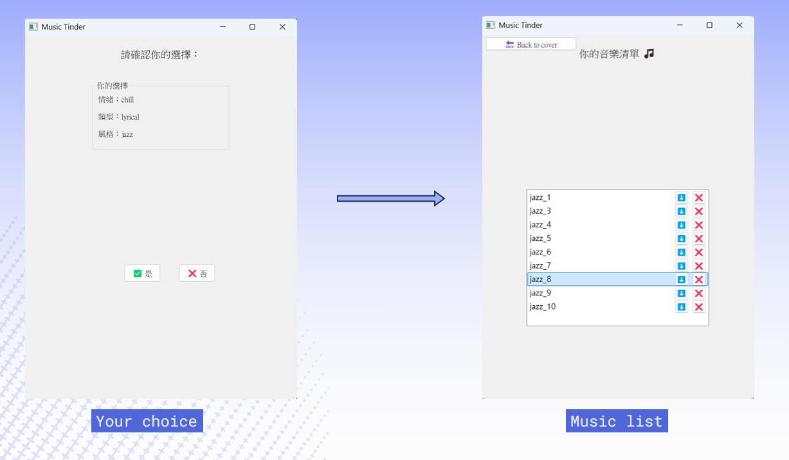

# AI 音樂生成與風格辨認
本專案主要目的為透過HuggingFace 的 MusicGen 模型生成音樂(驗證集)， 並使用CNN 搭配 Transformer 建立的分類模型來判別音樂種類，模型使用的訓練集為[GTZAN](https://www.kaggle.com/datasets/andradaolteanu/gtzan-dataset-music-genre-classification)，最終再透過PyQt5設計的介面，選擇妳喜歡的音樂。


---

### 功能特色
- **語言**：Python 3
- **用途**：利用分類模型判別音樂種類
- **特色**：
     - 透過prompt從 MusicGen 中產生特定風格的音樂
     - 建立可自動判別音樂風格的模型


### 安裝要求
請使用 **Python 3.8+** 的環境（建議使用 [Google Colab](https://colab.research.google.com/)），並安裝以下必要套件：
```bash
pip install transformers==4.37.2 accelerate torchaudio --quiet
pip install scipy librosa soundfile tensorflow tf-keras natsort
pip install natsort kaggle
```
---

### 模型架構說明：CNN + Transformer 混合網路

- **CNN**：提取音訊的局部特徵
- **Transformer**：補足 CNN 缺乏長期記憶的能力（時間序列記憶）

輸入格式：`(batch_size, 173, 89, 1)`

| 層級 | 類型與說明 |
|------|------------|
| Layer 1 | `Input(shape=(173, 89, 1))` |
| Layer 2 | `Conv2D(8) + MaxPooling2D + BatchNormalization` |
| Layer 3 | `Reshape((86, 352))`  |
| Layer 4 | `MultiHeadAttention(num_heads=1, key_dim=16)`|
| Layer 5 | `Add + LayerNormalization`|
| Layer 6 | `Dense(352) + Add + LayerNorm`|
| Layer 7 | `GlobalAveragePooling1D()`|
| Layer 8 | `Dense(32) + Dropout(0.5)`|
| Layer 9 | `Dense(10, activation='softmax')`|


### GUI介面設計
**首頁**：顯示封面圖與兩個按鈕
  - `Start 🎶`：開始選曲流程  
  - `Information ℹ️`：顯示訓練結果與分類準確率圖片  

- **互動流程**：
  1. **情緒選擇**：Chill 或 Sad
  2. **類型選擇**：如 Lyrical / Upbeat / Heartfelt / Thunderous
  3. **風格推薦**：每種類型對應 2~3 個音樂風格，逐一播放並詢問使用者是否喜歡
  4. **試聽音樂**：根據選擇的風格播放 10 首樣本音樂，逐首按 👍 / 👎 評估
  5. **建立收藏清單**：顯示所有喜歡的音樂，可播放、刪除或下載 `.wav` 檔案
 
---
## 程式畫面及訓練圖
此圖表呈現 CNN + Transformer 模型在訓練與驗證集上的損失(loss)與準確率(accuracy)變化情形


此圖為音樂在模型預測過後產生的Confusion Matrix



以下圖為此程式之GUI及選擇音樂的過程


